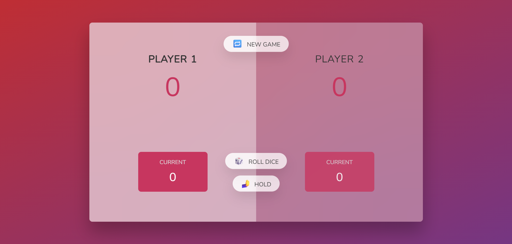

# 🎲 Dice Game

A simple and interactive two-player dice game built with HTML, CSS, and JavaScript.



## 🚀 Features

- Two-player gameplay with turn-based mechanics
- Roll the dice to accumulate points
- Hold your current score to bank it
- First player to reach 100 points wins
- Responsive design with smooth animations
- Visual feedback for active player and winner

## 🛠️ Technologies Used

- HTML5 - Structure and semantics
- CSS3 - Styling and animations
- JavaScript - Game logic and interactivity
- Google Fonts (Nunito) - Typography

## 🎮 How to Play

1. Player 1 starts first
2. Click "🎲 Roll dice" to roll
3. Accumulate points in your current score
4. Click "🫸 Hold" to bank points (ends turn)
5. Rolling a 1️⃣ loses your turn's points
6. First to 100 points wins!

## 📋 Game Rules

- Each roll adds to your current score
- Hold to transfer current score to total
- Rolling 1 clears your current score and ends turn
- First player to reach 100 total points wins

## 🖥️ Installation & Usage

```bash
# Clone the repository
git clone https://github.com/Sujal-Dudhe/Dice-Game.git

# Open the game
Open index.html in your browser

## 📂 Project Structure

Dice-Game/
├── index.html          # Main game file
├── style.css           # Styles
├── script.js           # Game logic
├── img/                # Assets
│   ├── dice-1.png
│   ├── dice-2.png
│   ├── dice-3.png
│   ├── dice-4.png
│   ├── dice-5.png
│   ├── dice-6.png
│   └── screenshot.png  # Game preview
└── README.md           # Documentation
```

## 🎨 Design Elements

- Gradient background with glassmorphism effect
- Responsive layout with flexbox
- Smooth transitions and animations
- Clean and intuitive UI

## 🤝 Contributing

Contributions are welcome! Please follow these steps:

1. Fork the project
2. Create your feature branch (git checkout -b feature/AmazingFeature)
3. Commit your changes (git commit -m 'Add some AmazingFeature')
4. Push to the branch (git push origin feature/AmazingFeature)
5. Open a Pull Request

## 📬 Contact

📧 sujaldudhe2004@gmail.com
</>[GitHub Profile](https://github.com/Sujal-Dudhe)
𝕏[X/Twitter Profile](https://x.com/Iamsujal_111)
🎲 [Dice Game Repo](https://github.com/Sujal-Dudhe/Dice-Game)
